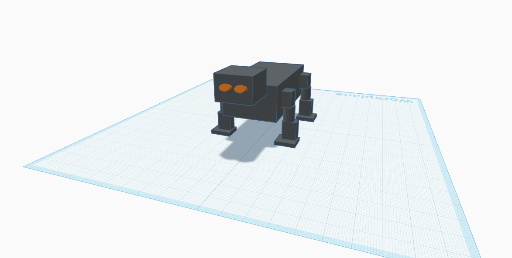

   # Robotic Dog Design

## Description
This project presents a 3D robotic dog model designed using Tinkercad as part of the Mechanical Engineering learning path.

## Features
- 3D robotic dog model
- Four-leg mechanical design
- Stable and simple structure
- Educational engineering project

## Technologies Used
- Tinkercad

## Design Overview
- The robot body was designed using simple geometric shapes.
- It has four legs for improved balance and stability.
- The design includes 4 Degrees of Freedom (4 DOF).
- Servo motors are proposed to control the movement of each leg.
- A quadruped walking gait is used for stable movement.

## Files
- robotic-dog.stl – 3D model file
- IMG_0579.png – Project screenshot

## Design Preview

## Project Goal
To practice 3D mechanical design by creating a robotic dog model using Tinkercad.

## Author
Sara Saud Alotaibi

